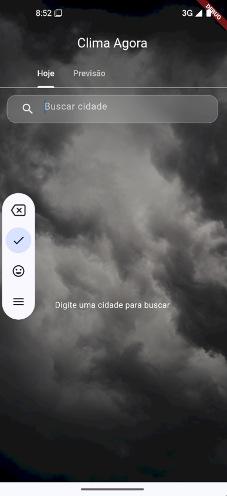
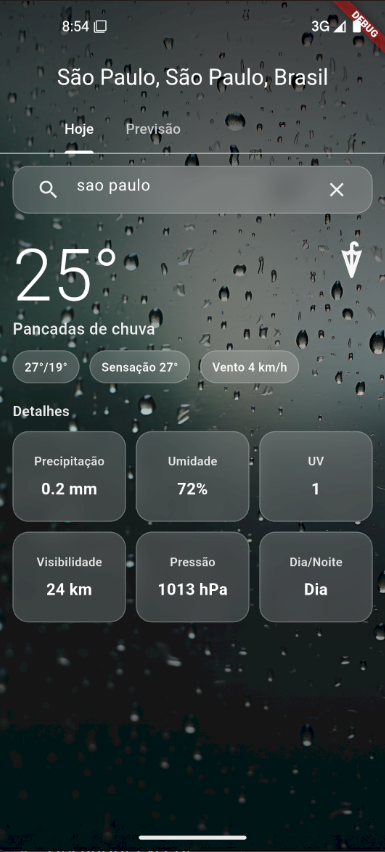

# 🌦️ Clima Agora (Flutter)

<div align="center">


### 📱 Aplicativo meteorológico leve, rápido e moderno


</div>

---

## Interview

### GIFs do app


### Prints do app






---

## 🚀 Sobre o projeto

O **Clima Agora** é um aplicativo desenvolvido em Flutter com foco em **simplicidade, performance e boa arquitetura**.

A aplicação permite buscar cidades em tempo real e visualizar a temperatura atual, com uma interface dinâmica que se adapta às condições climáticas.

> 💡 Projeto criado como MVP para estudo de arquitetura moderna em Flutter.

---

## ✨ Funcionalidades

🔍 Busca de cidades com autocomplete  
🌡️ Exibição da temperatura atual  
🌆 Background dinâmico baseado no clima  
⚡ Interface leve e rápida  
💾 Persistência local de preferências (nome e última cidade)  
👋 Saudação contextual com retomada da última cidade pesquisada  
🗺️ Planejamento de viagem com múltiplas paradas  
📍 Origem por geolocalização atual ou cidade manual  
🤖 Sugestões de atividades por IA via backend

---

## 🛠️ Tecnologias utilizadas

<div align="center">


</div>

### 💡 Stack

* **Flutter (Material 3)** → Desenvolvimento da interface
* **Dart** → Linguagem principal
* **HTTP (`http`)** → Consumo de APIs externas
* **Geolocator** → Localização do usuário no dispositivo
* **Shared Preferences** → Persistência local de dados de usuário
* **Node.js + Express (backend/)** → Proxy seguro para IA
* **Open-Meteo API** → Dados climáticos em tempo real (sem necessidade de chave)
* **OpenRouteService (opcional)** → Roteamento de carro por API key

---

## 🧠 Arquitetura

O projeto segue uma abordagem **Feature-Based + Clean Architecture**, com separação clara de responsabilidades:

```text
lib/
 ┣ main.dart
 ┗ src/
    ┗ features/
       ┣ weather/
       ┃  ┣ data/
       ┃  ┣ domain/
       ┃  ┗ presentation/
       ┗ travel_planning/
          ┣ data/
          ┣ domain/
          ┗ presentation/

backend/
 ┣ src/server.js
 ┗ .env (local, não versionado)
```

### 📌 Camadas

* **data** → Consumo de APIs e repositórios
* **domain** → Modelos e regras de negócio
* **presentation** → Interface e lógica de exibição

---

## 🌐 APIs utilizadas

* 🔎 Open-Meteo Geocoding → Busca de cidades
* 🌡️ Open-Meteo Forecast → Dados climáticos atuais
* 🛣️ OpenRouteService Directions → Distância e duração entre paradas (quando `ORS_API_KEY` está configurada)
* 🤖 Gemini (via backend) → Sugestões de atividades de viagem

---

## 🤖 IA Sem Chave no App

Para usuários finais, a chave da IA **não fica no Flutter**. Ela fica no backend.

### Fluxo seguro

* App Flutter chama o endpoint `/travel/suggestions`
* Backend usa `GEMINI_API_KEY` em variável de ambiente
* Resposta volta para o app sem expor segredo ao usuário

### Configuração rápida

1. Suba o backend em `backend/` (ver [backend/README.md](backend/README.md)).
2. Rode o app apontando para o backend:

```bash
flutter run --dart-define=AI_BACKEND_URL=http://SEU_BACKEND:8787
```

3. (Opcional) habilite roteamento real da viagem com OpenRouteService:

```bash
flutter run \
   --dart-define=AI_BACKEND_URL=http://SEU_BACKEND:8787 \
   --dart-define=ORS_API_KEY=SUA_CHAVE_ORS
```

> Sem `ORS_API_KEY`, o app usa estimativa local de distância/tempo por Haversine.

---

## 📱 Permissões Android

Para usar origem por localização atual, o Android precisa das permissões:

* `ACCESS_COARSE_LOCATION`
* `ACCESS_FINE_LOCATION`

Essas permissões já estão declaradas no projeto.

---

## 🎨 Assets

As imagens de fundo são alteradas dinamicamente conforme o clima:

* ☀️ Ensolarado → `bg_sunny.jpg`
* ☁️ Nublado → `bg_cloudy.jpg`
* 🌧️ Chuva → `bg_rain.jpg`
* ❄️ Neve → `bg_snow.jpg`

---

## ⚙️ Como executar

```bash
# Instalar dependências
flutter pub get

# Rodar o projeto
flutter run
```

---

## 🧩 Como funciona

* Busca de cidades via **Open-Meteo Geocoding API**
* Clima atual via **Open-Meteo Forecast API**
* Conversão de `weather_code` para UI feita em:

```text
weather_ui_mapper.dart
```

---

## 📈 Boas práticas aplicadas

✔️ Separação por camadas  
✔️ Debounce na busca (melhora performance)  
✔️ Repositório centralizado  
✔️ Código organizado e escalável  
✔️ Segredos de IA fora do app (backend + variáveis de ambiente)

---

## 🆕 Atualizações recentes (07/04/2026)

* Adicionada a aba **Planeje Sua Viagem** com múltiplas cidades de parada.
* Implementado cálculo de rota entre origem e destinos com OpenRouteService (fallback estimado sem chave).
* Incluídas sugestões de atividades por IA via endpoint backend `/travel/suggestions`.
* Implementada persistência local de nome do usuário, última cidade e contagem de aberturas do app.
* Adicionada bolha de saudação temporal com retomada da última cidade pesquisada.
* Atualizado AndroidManifest com permissões de localização para fluxo de origem atual.
* Adicionado backend Node/Express em `backend/` com `GEMINI_API_KEY` restrita ao servidor.

---

## 🚧 Próximos passos

🌬️ Adicionar vento, umidade e sensação térmica  
🧪 Implementar testes unitários  
📱 Melhorias na UI/UX  
🧭 Exibir alternativa de modal de transporte (carro/transporte público) no planejamento

---

## 👨‍💻 Autor

**Leonardo Souza Bezerra**

🚀 Desenvolvedor focado em backend e arquitetura  
📚 Sempre evoluindo com projetos práticos

---

<div align="center">

⭐ Se curtiu o projeto, deixa uma estrela!

</div>
